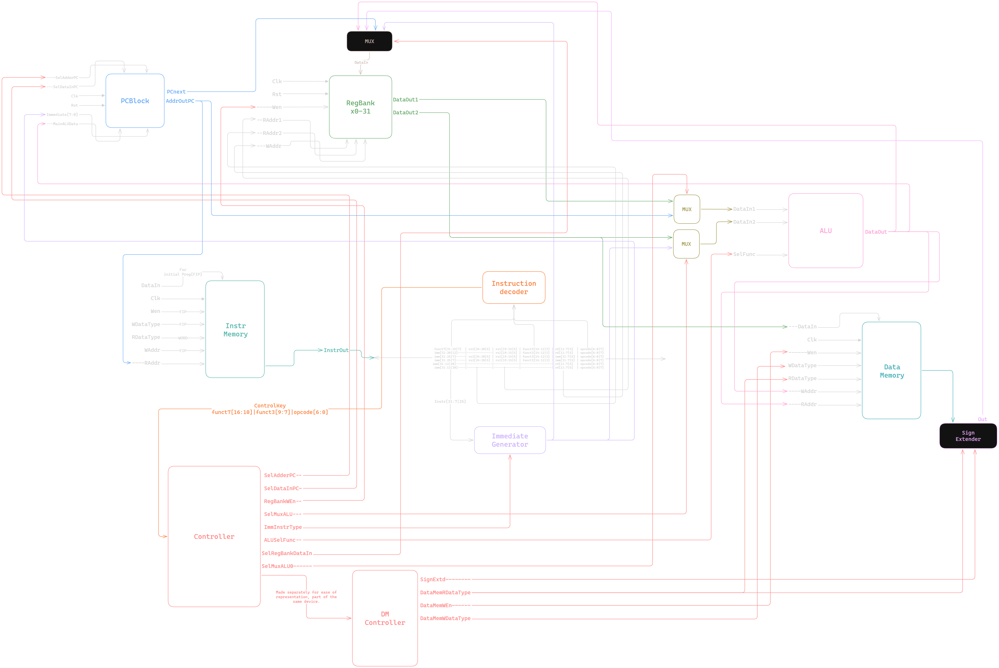
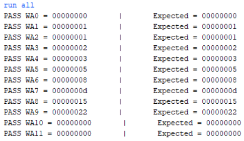
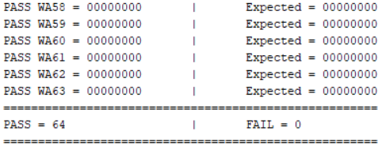
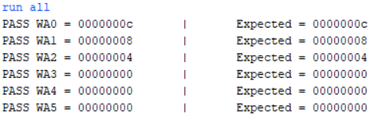
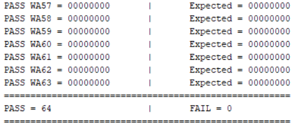

# RV32I Single-Cycle RISC-V Processor (Verilog)
Implemented from scratch in Verilog after learning the RISC-V ISA, progressing from isolated module verification to full-system execution and automated memory-based regression testing.
It took 17 days from learning RISC-V to complete processor implementation. 

### Technical Specifications
- **RV32I** base integer instruction set
- **Harvard architecture** (separate instruction and data memory)
- **Byte-addressable** Instruction/data memory
- **Self-checking** verification environment
- **Memory Space:** 8-bit Address Space (256-byte Byte-addressable simulation memory)
- **Development Tools:** AMD/Xilinx Vivado

---
# Processor Architecture 




## Supported Instructions

| Category        | Instructions                       |
| --------------- | ---------------------------------- |
| Arithmetic      | ADD, SUB                           |
| Logical         | AND, OR, XOR                       |
| Shift           | SLL, SRL, SRA                      |
| Compare         | SLT, SLTU                          |
| Immediate       | ADDI, ANDI, ORI, XORI, SLTI, SLTIU |
| Loads           | LB, LH, LW, LBU, LHU               |
| Stores          | SB, SH, SW                         |
| Branches        | BEQ, BNE, BLT, BGE                 |
| Jump            | JAL, JALR                          |
| Upper Immediate | LUI, AUIPC                         |

---
## Component Breakdown
#### PCBlock
Maintains the program counter and contains dedicated adders for computing both `PC + 4` and `PC + immediate`. A multiplexer selects the next PC value, while `PCnext` is exposed for JAL and JALR writeback operations.

#### ByteAdrRAM
Byte-addressable memory module used for both instruction and data storage. Supports full-word instruction fetches and byte, halfword, and word accesses for data memory operations.

#### ImmGen
Generates sign-extended immediates for all RV32I instruction formats, including I-type, S-type, B-type, U-type, and J-type encodings.

#### InstrDecoder
Extracts `opcode`, `funct3`, and `funct7` fields from the instruction word and combines them into a pre-decoded `ControlKey` bus used by the controller.

#### Controller
Purely combinational control unit that generates all datapath control signals from the decoded instruction information and branch comparison results provided by the ALU.

#### ALU
Performs arithmetic, logical, shift, and comparison operations required by the RV32I ISA, including signed and unsigned comparisons used by branch instructions.

#### RegBank32
Implements the 32-entry RISC-V register file. Register `x0` is permanently tied to zero, reads are asynchronous, and writes occur synchronously on the clock edge.

#### SignExtender
Processes data read from memory and applies sign extension or zero extension according to the active load instruction and memory access type.


---
## Design Hierarchy

```
RV32I Processor (datapath.v)
│
├── Program Counter Subsystem
│   └── PCBlock
│
├── Control Path
│   ├── InstrDecoder
│   └── Controller
│
├── Register File
│   └── RegBank32
│
├── Immediate Generation
│   └── ImmGen
│
├── Execution Unit
│   ├── ALU
│   └── Operand Selection MUXes
│
├── Instruction Memory
│   └── ByteAdrRAM
│
├── Data Memory
│   ├── ByteAdrRAM
│   └── SignExtender
│
└── Writeback Network
    └── 4-to-1 Result MUX
```

---
## Verification Strategy

The primary verification method is a self-checking testbench driven by `.mem` files. Instruction memory and data memory are both preloaded via `$readmemh` before simulation begins.

**Testbench flow:**

```
write_data()        // preload DM with operands
write_program()     // preload IM with instructions  
reset_PC_RB()       // assert reset
drop_reset_PC_RB()  // release reset, execution begins
#delay              // allow sufficient simulation time
check_DM()          // compare DM against target.mem
```

**check_DM task** compares all 64 word addresses against a `target.mem` file, reporting PASS/FAIL per address with both actual and expected values. Since stores depend on correct register values, ALU results, immediate generation, and control flow all being correct simultaneously, a clean DM match implicitly validates the entire execution path.

A Python reference model was used during early development for little-endian memory layout verification. This was later replaced by the `target.mem` based self-checking approach which was used for all subsequent instruction types.

Key parameters (`DATA_WIDTH`, `PC_DATA_WIDTH`, data type encodings) are defined at the top level and propagated through the hierarchy, avoiding hardcoded magic numbers throughout the design.

### Test programs written and verified:

**Fibonacci**  
This was the first integration test, for non branch type instructions.   
  



**GCD**  
This program is a comprehensive test of the entire datapath exercising loops and arithmetic instructions.    
  


---
## Notable Engineering Decisions

|Decision|Reason|
|---|---|
|Harvard architecture|Simplifies single-cycle execution|
|8-bit address space|Sufficient for simulation while reducing complexity|
|Pure combinational controller|No FSM required in single-cycle CPUs|
|Bottom-up development|Easier isolation and debugging|
|Build modules only when required|Reduced unnecessary complexity|
|Self-checking testbench|Repeatable regression testing|

---
### Scalability Notes

The 8-bit address space is a simulation constraint, not an architectural limitation.  
Address width is set by a single parameter (`PC_DATA_WIDTH`) at the top level ,extending to 32-bit addressing only requires widening the memory interface. The datapath and control logic need no changes.

---
## Repository Structure

```
single-cycle-rv32i-cpu/
├── src/      # Verilog source files
├── sim/      # Testbench, instruction .mem files, and expected output (target.mem)
└── images/   # Architecture diagrams and waveform screenshots
```
---
# Conclusion

A fully verified single-cycle RV32I processor, built from first principles in 17 days. Every instruction type in the base ISA is implemented and verified against known-good outputs.

